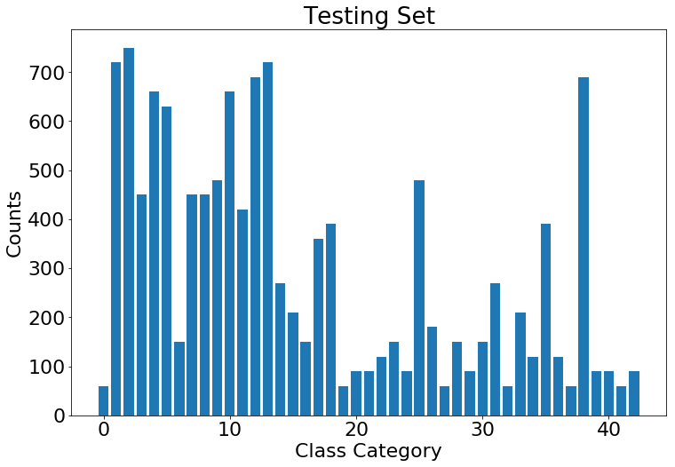

# Self-Driving Car Engineer Nanodegree

## Project: Build a Traffic Sign Recognition Classifier

---

**Build a Traffic Sign Recognition Project**

The goals / steps of this project are the following:
* Load the data set (see below for links to the project data set)
* Explore, summarize and visualize the data set
* Design, train and test a model architecture
* Use the model to make predictions on new images
* Analyze the softmax probabilities of the new images
* Summarize the results with a written report

## Rubric Points
### Here I will consider the [rubric points](https://review.udacity.com/#!/rubrics/481/view) individually and describe how I addressed each point in my implementation.  

---
### Writeup / README

You're reading it! and here is a link to my [project code](https://github.com/yizonggen/CarND-Traffic-Sign-Classifier-Project/blob/master/Traffic_Sign_Classifier.ipynb)

---
### Data Set Summary & Exploration
---
#### Step 0: Load The Data


```python
# Load pickled data

# TODO: Fill this in based on where you saved the training and testing data

training_file = '../data/train.p'
validation_file= '../data/valid.p'
testing_file = '../data/test.p'

with open(training_file, mode='rb') as f:
    train = pickle.load(f)
with open(validation_file, mode='rb') as f:
    valid = pickle.load(f)
with open(testing_file, mode='rb') as f:
    test = pickle.load(f)
    
X_train, y_train = train['features'], train['labels']
X_valid, y_valid = valid['features'], valid['labels']
X_test, y_test = test['features'], test['labels']
```

---

#### Step 1: Dataset Summary & Exploration

The pickled data is a dictionary with 4 key/value pairs:

- `'features'` is a 4D array containing raw pixel data of the traffic sign images, (num examples, width, height, channels).
- `'labels'` is a 1D array containing the label/class id of the traffic sign. The file `signnames.csv` contains id -> name mappings for each id.
- `'sizes'` is a list containing tuples, (width, height) representing the original width and height the image.
- `'coords'` is a list containing tuples, (x1, y1, x2, y2) representing coordinates of a bounding box around the sign in the image. **THESE COORDINATES ASSUME THE ORIGINAL IMAGE. THE PICKLED DATA CONTAINS RESIZED VERSIONS (32 by 32) OF THESE IMAGES**


#### Provide a Basic Summary of the Data Set Using Python, Numpy and/or Pandas


```python
### Replace each question mark with the appropriate value. 
### Use python, pandas or numpy methods rather than hard coding the results
# TODO: Number of training examples
n_train = X_train.shape[0]

# TODO: Number of validation examples
n_validation = X_valid.shape[0]

# TODO: Number of testing examples.
n_test = X_test.shape[0]

# TODO: What's the shape of an traffic sign image?
image_shape = X_train.shape[1:]

# TODO: How many unique classes/labels there are in the dataset.
n_classes = len(np.unique(y_train))

print("Number of training examples =", n_train)
print("Number of testing examples =", n_test)
print("Image data shape =", image_shape)
print("Number of classes =", n_classes)
```

    Number of training examples = 34799
    Number of testing examples = 12630
    Image data shape = (32, 32, 3)
    Number of classes = 43


#### Include an exploratory visualization of the dataset

Here is an exploratory visualization of the data set. I visualized the German Traffic Signs Dataset using the randomly selected samples from the pickled file(s). I also included the bar charts showing the number of samples for each classes in training, validation and testing data set.

```python
### Data exploration visualization code goes here.
### Feel free to use as many code cells as needed.

# randomly show multiple, i.e. 16, images from the training dataset

num_row = 4
num_col = 4
num_img = num_row*num_col

np.random.seed(100)
random_picked_index = np.random.randint(len(X_train), size=num_img)

index_array = random_picked_index.reshape((num_row, num_col))

fig, axes = plt.subplots(num_row,num_col, figsize=(16, 16))

for row_idx in range(num_row):
    for col_idx in range(num_col):
        index = index_array[row_idx, col_idx]
        image = X_train[index]
        axes[row_idx, col_idx].axis('off')
        axes[row_idx, col_idx].imshow(image)
        axes[row_idx, col_idx].set_title('class: {}'.format(y_train[index]))
        
```


```python
# this is the function to count the number of each traffic sign category.
def show_class_count_num(data, title_name):
    data_counter = Counter(data)

    class_list = []
    count_list = []

    for key, value in data_counter.items():
        class_list.append(key)
        count_list.append(value)

    plt.figure(figsize=(12, 8))
    plt.rcParams.update({'font.size': 22})
    plt.bar(class_list, count_list)
    plt.xlabel('Class Category')
    plt.ylabel('Counts')
    plt.title(title_name)
    plt.show()
```


```python
# plot the count of each sign in the training, validation and testing sets
show_class_count_num(y_train, 'Training Set')
show_class_count_num(y_valid, 'Validation Set')
show_class_count_num(y_test, 'Testing Set')
```





----

### Design and Test a Model Architecture


#### 1. Pre-process the Data Set (normalization, grayscale, etc.)

The preprocessing process consists of the following steps:

- The color images in the input dataset has been converted into grayscale images. The color information in the traffic signal is not the key part to classify the traffic signs in this problem (of course, if we have to classify the traffic lights, e.g. red, yellow, green, this will be an important perspective). Therefore, transfering the color image can help to reduce the size of the input data, which will reduce the requirement on complicated models and also can reduce the training time.

- The input image data has been normalized so that the data has approximately mean zero and equal variance. For this project, a simple calculation, e.g. (pixel - 128)/ 128 is used to approximately normalize the image data. However, we can see that the mean value is not exactly zero (about -0.35), but is close to zero and the training, validation and testing dataset are similar to each other. The normalization will help to ensure different features have similar ranges, which will make the training process easier to converge under a given learning rate.

Other preprocessing methods are not utilized at this point. Another method, e.g. data augmentation, can also help to improve the performance. 


```python
### Preprocess the data here. It is required to normalize the data. Other preprocessing steps could include 
### converting to grayscale, etc.
### Feel free to use as many code cells as needed.

# Convert to grayscale
X_train_gray = np.sum(X_train/3, axis=3, keepdims=True)
print('Training set Grayscale image shape:', X_train_gray.shape)

X_valid_gray = np.sum(X_valid/3, axis=3, keepdims=True)
print('Validation set Grayscale image shape:', X_valid_gray.shape)

X_test_gray = np.sum(X_test/3, axis=3, keepdims=True)
print('Testing set Grayscale image shape:', X_test_gray.shape)
```

    Training set Grayscale image shape: (34799, 32, 32, 1)
    Validation set Grayscale image shape: (4410, 32, 32, 1)
    Testing set Grayscale image shape: (12630, 32, 32, 1)


```python
## Normalize the train and test datasets to (-1,1)
X_train_normalized = (X_train_gray - 128)/128 
X_valid_normalized = (X_valid_gray - 128)/128 
X_test_normalized = (X_test_gray - 128)/128
print(np.mean(X_train_normalized))
print(np.mean(X_valid_normalized))
print(np.mean(X_test_normalized))
```

    -0.354081335648
    -0.347215411128
    -0.358215153428


```python
X_train = X_train_normalized
X_valid = X_valid_normalized
X_test = X_test_normalized
```


#### 2. Describe what your final model architecture looks like including model type, layers, layer sizes, connectivity, etc.) Consider including a diagram and/or table describing the final model.

The following is the model architecture for the original LeNet-5, which is defined in "LeNet(x)". This is starting point for building the DL model for our task.

- 5x5 convolution (32x32x1 in, 28x28x6 out)
- ReLU
- 2x2 max pool (28x28x6 in, 14x14x6 out)
- 5x5 convolution (14x14x6 in, 10x10x16 out)
- ReLU
- 2x2 max pool (10x10x16 in, 5x5x16 out)
- Flatten layer (5x5x16 -> 400)
- Fully connected layer (400 in, 120 out)
- ReLU
- Dropout layer
- Fully connected layer (120 in, 84 out)
- ReLU
- Dropout layer
- Fully connected layer (84 in, 43 out)


When the original LeNet-5 is used, the model is under fitted using the given training data. In order to have a better testing accuracy, I have modified the model by adding an additional fully connected layer and also change the number of neurons in the fully connected layer. The following is the model architecture for the modified LeNet, which is defined in "LeNet_modified(x)"

- 5x5 convolution (32x32x1 in, 28x28x6 out)
- ReLU
- 2x2 max pool (28x28x6 in, 14x14x6 out)
- 5x5 convolution (14x14x6 in, 10x10x16 out)
- ReLU
- 2x2 max pool (10x10x16 in, 5x5x16 out)
- Flatten layer (5x5x16 -> 400)
- Fully connected layer (400 in, 512 out)
- ReLU
- Dropout layer
- Fully connected layer (512 in, 256 out)
- ReLU
- Dropout layer
- Fully connected layer (256 in, 128 out)
- ReLU
- Dropout layer
- Fully connected layer (128 in, 43 out)


```python
### Define your architecture here.
### Feel free to use as many code cells as needed.

def LeNet(x):    
    # Arguments used for tf.truncated_normal, randomly defines variables for the weights and biases for each layer
    mu = 0
    sigma = 0.1
    
    # Layer 1: Convolutional. Input = 32x32x1. Output = 28x28x6.
    conv1_W = tf.Variable(tf.truncated_normal(shape=(5, 5, 1, 6), mean = mu, stddev = sigma))
    conv1_b = tf.Variable(tf.zeros(6))
    conv1   = tf.nn.conv2d(x, conv1_W, strides=[1, 1, 1, 1], padding='VALID') + conv1_b

    # Activation.
    conv1 = tf.nn.relu(conv1)

    # Pooling. Input = 28x28x6. Output = 14x14x6.
    conv1 = tf.nn.max_pool(conv1, ksize=[1, 2, 2, 1], strides=[1, 2, 2, 1], padding='VALID')

    # Layer 2: Convolutional. Output = 10x10x16.
    conv2_W = tf.Variable(tf.truncated_normal(shape=(5, 5, 6, 16), mean = mu, stddev = sigma))
    conv2_b = tf.Variable(tf.zeros(16))
    conv2   = tf.nn.conv2d(conv1, conv2_W, strides=[1, 1, 1, 1], padding='VALID') + conv2_b
    
    # Activation.
    conv2 = tf.nn.relu(conv2)

    # Pooling. Input = 10x10x16. Output = 5x5x16.
    conv2 = tf.nn.max_pool(conv2, ksize=[1, 2, 2, 1], strides=[1, 2, 2, 1], padding='VALID')

    # Flatten. Input = 5x5x16. Output = 400.
    fc0   = flatten(conv2)
    
    # Layer 3: Fully Connected. Input = 400. Output = 120.
    fc1_W = tf.Variable(tf.truncated_normal(shape=(400, 120), mean = mu, stddev = sigma))
    fc1_b = tf.Variable(tf.zeros(120))
    fc1   = tf.matmul(fc0, fc1_W) + fc1_b
    
    # Activation.
    fc1    = tf.nn.relu(fc1)

    # Layer 4: Fully Connected. Input = 120. Output = 84.
    fc2_W  = tf.Variable(tf.truncated_normal(shape=(120, 84), mean = mu, stddev = sigma))
    fc2_b  = tf.Variable(tf.zeros(84))
    fc2    = tf.matmul(fc1, fc2_W) + fc2_b
    
    # Activation.
    fc2    = tf.nn.relu(fc2)

    # Layer 5: Fully Connected. Input = 84. Output = 43.
    fc3_W  = tf.Variable(tf.truncated_normal(shape=(84, 43), mean = mu, stddev = sigma))
    fc3_b  = tf.Variable(tf.zeros(43))
    logits = tf.matmul(fc2, fc3_W) + fc3_b
    
    return logits
```


```python
def LeNet_modified(x):    
    # Arguments used for tf.truncated_normal, randomly defines variables for the weights and biases for each layer
    mu = 0
    sigma = 0.1
    
    # Layer 1: Convolutional. Input = 32x32x1. Output = 28x28x6.
    conv1_W = tf.Variable(tf.truncated_normal(shape=(5, 5, 1, 6), mean = mu, stddev = sigma))
    conv1_b = tf.Variable(tf.zeros(6))
    conv1   = tf.nn.conv2d(x, conv1_W, strides=[1, 1, 1, 1], padding='VALID') + conv1_b

    # Activation.
    conv1 = tf.nn.relu(conv1)

    # Pooling. Input = 28x28x6. Output = 14x14x6.
    conv1 = tf.nn.max_pool(conv1, ksize=[1, 2, 2, 1], strides=[1, 2, 2, 1], padding='VALID')

    # Layer 2: Convolutional. Output = 10x10x16.
    conv2_W = tf.Variable(tf.truncated_normal(shape=(5, 5, 6, 16), mean = mu, stddev = sigma))
    conv2_b = tf.Variable(tf.zeros(16))
    conv2   = tf.nn.conv2d(conv1, conv2_W, strides=[1, 1, 1, 1], padding='VALID') + conv2_b
    
    # Activation.
    conv2 = tf.nn.relu(conv2)

    # Pooling. Input = 10x10x16. Output = 5x5x16.
    conv2 = tf.nn.max_pool(conv2, ksize=[1, 2, 2, 1], strides=[1, 2, 2, 1], padding='VALID')

    # Flatten. Input = 5x5x16. Output = 400.
    fc0   = flatten(conv2)
    
    # Layer 3: Fully Connected. Input = 400. Output = 512.
    fc1_W = tf.Variable(tf.truncated_normal(shape=(400, 512), mean = mu, stddev = sigma))
    fc1_b = tf.Variable(tf.zeros(512))
    fc1   = tf.matmul(fc0, fc1_W) + fc1_b
    
    # Activation.
    fc1    = tf.nn.relu(fc1)
    
    # Layer 4: Fully Connected. Input = 512. Output = 256.
    fc2_W = tf.Variable(tf.truncated_normal(shape=(512, 256), mean = mu, stddev = sigma))
    fc2_b = tf.Variable(tf.zeros(256))
    fc2   = tf.matmul(fc1, fc2_W) + fc2_b
    
    # Activation.
    fc2    = tf.nn.relu(fc2)

    # Layer 5: Fully Connected. Input = 256. Output = 128.
    fc3_W  = tf.Variable(tf.truncated_normal(shape=(256, 128), mean = mu, stddev = sigma))
    fc3_b  = tf.Variable(tf.zeros(128))
    fc3    = tf.matmul(fc2, fc3_W) + fc3_b
    
    # Activation.
    fc3    = tf.nn.relu(fc3)

    # Layer 6: Fully Connected. Input = 128. Output = 43.
    fc4_W  = tf.Variable(tf.truncated_normal(shape=(128, 43), mean = mu, stddev = sigma))
    fc4_b  = tf.Variable(tf.zeros(43))
    logits = tf.matmul(fc3, fc4_W) + fc4_b
    
    return logits
```

#### 3. Describe how you trained your model. The discussion can include the type of optimizer, the batch size, number of epochs and any hyperparameters such as learning rate.

To train the model, I used an Adam optimizer is used. The hyperparameters are used as follows:

- batch size: 128
- epochs: 50
- learning rate: 0.001
- mu: 0
- sigma: 0.1
- dropout keep probability: 0.7


```python
epochs = 50
batch_size = 128
learning_rate = 0.001
model_save_path = 'trained_model.ckpt'
```


```python
tf.reset_default_graph() 

x = tf.placeholder(tf.float32, (None, 32, 32, 1))
y = tf.placeholder(tf.int32, (None))
keep_prob = tf.placeholder(tf.float32) # probability to keep units in Dropout layer
one_hot_y = tf.one_hot(y, 43)
```

### Train, Validate and Test the Model

A validation set can be used to assess how well the model is performing. A low accuracy on the training and validation
sets imply underfitting. A high accuracy on the training set but low accuracy on the validation set implies overfitting.

#### The following training codes are based on the resources in the classroom of CNN lesson and has been modified accordingly based on my specific needs.


```python
### Train your model here.
### Calculate and report the accuracy on the training and validation set.
### Once a final model architecture is selected, 
### the accuracy on the test set should be calculated and reported as well.
### Feel free to use as many code cells as needed.

#logits = LeNet(x)
logits = LeNet_modified(x)
cross_entropy = tf.nn.softmax_cross_entropy_with_logits(labels=one_hot_y, logits=logits)
loss_operation = tf.reduce_mean(cross_entropy)
optimizer = tf.train.AdamOptimizer(learning_rate = learning_rate)
training_operation = optimizer.minimize(loss_operation)
```


```python
correct_prediction = tf.equal(tf.argmax(logits, 1), tf.argmax(one_hot_y, 1))
accuracy_operation = tf.reduce_mean(tf.cast(correct_prediction, tf.float32))
saver = tf.train.Saver()

def evaluate(X_data, y_data):
    num_examples = len(X_data)
    total_accuracy = 0
    sess = tf.get_default_session()
    for offset in range(0, num_examples, batch_size):
        batch_x, batch_y = X_data[offset:offset+batch_size], y_data[offset:offset+batch_size]
        accuracy = sess.run(accuracy_operation, feed_dict={x: batch_x, y: batch_y, keep_prob: 1.0})
        total_accuracy += (accuracy * len(batch_x))
    return total_accuracy / num_examples
```


```python
with tf.Session() as sess:
    sess.run(tf.global_variables_initializer())
    num_examples = len(X_train)
    
    print("Start Training Process ....")
    maximum_validation_acc = 0
    for i in range(epochs):
        X_train, y_train = shuffle(X_train, y_train)
        for offset in range(0, num_examples, batch_size):
            end = offset + batch_size
            batch_x, batch_y = X_train[offset:end], y_train[offset:end]
            sess.run(training_operation, feed_dict={x: batch_x, y: batch_y, keep_prob: 0.7})
            
        validation_accuracy = evaluate(X_valid, y_valid)
        print("Epoch {}: Validation Accuracy = {:.4f}".format(i+1, validation_accuracy))
        if validation_accuracy>maximum_validation_acc:
            maximum_validation_acc = validation_accuracy
            saver.save(sess, model_save_path)
            print("Model saved")
#     saver.save(sess, './lenet')
#     print("Model saved")        
```

    Start Training Process ....
    Epoch 1: Validation Accuracy = 0.8268
    Model saved
    Epoch 2: Validation Accuracy = 0.8753
    Model saved
    Epoch 3: Validation Accuracy = 0.8912
    Model saved
    Epoch 4: Validation Accuracy = 0.8991
    Model saved
    Epoch 5: Validation Accuracy = 0.9127
    Model saved
    Epoch 6: Validation Accuracy = 0.9172
    Model saved
    Epoch 7: Validation Accuracy = 0.9202
    Model saved
    Epoch 8: Validation Accuracy = 0.9256
    Model saved
    Epoch 9: Validation Accuracy = 0.9143
    Epoch 10: Validation Accuracy = 0.9100
    Epoch 11: Validation Accuracy = 0.9204
    Epoch 12: Validation Accuracy = 0.9147
    Epoch 13: Validation Accuracy = 0.9186
    Epoch 14: Validation Accuracy = 0.9154
    Epoch 15: Validation Accuracy = 0.9193
    Epoch 16: Validation Accuracy = 0.9243
    Epoch 17: Validation Accuracy = 0.9102
    Epoch 18: Validation Accuracy = 0.9129
    Epoch 19: Validation Accuracy = 0.9347
    Model saved
    Epoch 20: Validation Accuracy = 0.9184
    Epoch 21: Validation Accuracy = 0.9308
    Epoch 22: Validation Accuracy = 0.9082
    Epoch 23: Validation Accuracy = 0.9243
    Epoch 24: Validation Accuracy = 0.9039
    Epoch 25: Validation Accuracy = 0.9351
    Model saved
    Epoch 26: Validation Accuracy = 0.9240
    Epoch 27: Validation Accuracy = 0.9222
    Epoch 28: Validation Accuracy = 0.9172
    Epoch 29: Validation Accuracy = 0.9295
    Epoch 30: Validation Accuracy = 0.9209
    Epoch 31: Validation Accuracy = 0.9168
    Epoch 32: Validation Accuracy = 0.9340
    Epoch 33: Validation Accuracy = 0.9297
    Epoch 34: Validation Accuracy = 0.9317
    Epoch 35: Validation Accuracy = 0.9433
    Model saved
    Epoch 36: Validation Accuracy = 0.9501
    Model saved
    Epoch 37: Validation Accuracy = 0.9481
    Epoch 38: Validation Accuracy = 0.9490
    Epoch 39: Validation Accuracy = 0.9494
    Epoch 40: Validation Accuracy = 0.9485
    Epoch 41: Validation Accuracy = 0.9490
    Epoch 42: Validation Accuracy = 0.9494
    Epoch 43: Validation Accuracy = 0.9494
    Epoch 44: Validation Accuracy = 0.9503
    Model saved
    Epoch 45: Validation Accuracy = 0.9501
    Epoch 46: Validation Accuracy = 0.9497
    Epoch 47: Validation Accuracy = 0.9501
    Epoch 48: Validation Accuracy = 0.9510
    Model saved
    Epoch 49: Validation Accuracy = 0.9506
    Epoch 50: Validation Accuracy = 0.9512
    Model saved


```python
# Now (drumroll) evaluate the accuracy of the model on the test dataset

with tf.Session() as sess:
    sess.run(tf.global_variables_initializer())
    saver = tf.train.Saver()
    saver.restore(sess, model_save_path)
    test_accuracy = evaluate(X_test, y_test)
    print("Test Set Accuracy = {:.4f}".format(test_accuracy))

```

    INFO:tensorflow:Restoring parameters from trained_model.ckpt
    Test Set Accuracy = 0.9327


#### 4. Describes the approach to finding a solution. Accuracy on the validation set is 0.93 or greater.

The testing accuracy for the trained model is 93.27%

At the begining of the process to find the solution, I have tried the original model architecture of LeNet-5, which I only changed the number of outputs. But I found that the validation accuracy can only reach around 93%, which made the best testing accuracy around 91~92%. In order to improve the performance, I have modified the model architecture by adding one additional fully connected layer and also using larger size of fully connected layer. After using the modified model, I have got the validation accuracy larger then 95% after 50 epochs. The testing accuaracy is 93.27%. 

In order to get the solution, I also tried to adjust the hyper parameters in order to find a good performance for the trained model, for example, the learning rate and batch size, etc.

Furthermore, in order to reduce the overfitting, during the training process, I saved the model only when the validation accuracy is improved. This is the early stop method to ensure the model is not overfitted.

---

### Test a Model on New Images

#### 1. Choose five German traffic signs found on the web and provide them in the report. 

The images used for testing are obtained from https://routetogermany.com/drivingingermany/road-signs. These traffic signs are not different from photos which are taken from real world scenarios. There are no background information in these images. In this case, it should be easier for classification. However, our model is trained based on the real world images with other background information and the traffic signs in training set are not filled into entire image. There are difference between these testing images and the used training images.

Some images in our testing images may be difficult to be classified, for example, the "'new-found-traffic-signs/1.png'", although it is a speed limit sign, it has a characters "zone" in this image, this is different from most of the samples in our training data set.


```python
### Load the images and plot them here.
### Feel free to use as many code cells as needed.

import os
from PIL import Image

image_files  = ['new-found-traffic-signs/' + image_file for image_file in os.listdir('new-found-traffic-signs') if image_file.endswith('.png')]
labels = [int(image_file[:-4]) for image_file in os.listdir('new-found-traffic-signs') if image_file.endswith('.png')]
print("figure paths: {}".format(image_files))
print("labels: {}".format(labels))
```

    figure paths: ['new-found-traffic-signs/1.png', 'new-found-traffic-signs/10.png', 'new-found-traffic-signs/9.png', 'new-found-traffic-signs/23.png', 'new-found-traffic-signs/30.png', 'new-found-traffic-signs/3.png', 'new-found-traffic-signs/28.png', 'new-found-traffic-signs/36.png']
    labels: [1, 10, 9, 23, 30, 3, 28, 36]


```python
plt.rcParams.update({'font.size': 10})
images = []
for image_file in image_files:
    image = Image.open(image_file)
    image = image.convert('RGB')
    image = image.resize((32, 32), Image.ANTIALIAS)
    image = np.array(list(image.getdata()), dtype='uint8')
    image = np.reshape(image, (32, 32, 3))

    images.append(image)

images = np.array(images, dtype='uint8')
for i, image in enumerate(images):
    plt.subplot(2, 4, i+1)
    plt.imshow(image)

plt.tight_layout()
plt.show()
```


```python
images = np.asarray(images)
images_gray = np.sum(images/3, axis=3, keepdims=True)
images_normalized = (images_gray - 128)/128 

print(images_normalized.shape)
```

    (8, 32, 32, 1)


#### 2. Discuss the model's predictions on these new traffic signs and compare the results to predicting on the test set.

The trained model have predicted the new traffic signs with 75% accuracy (correctly predict 6 out of 8 images), which is less than the 93.27% testing accuracy. This is reasonable due to the small testing dataset and also some difference existing between these testing images and trainging images.

```python
### Run the predictions here and use the model to output the prediction for each image.
### Make sure to pre-process the images with the same pre-processing pipeline used earlier.
### Feel free to use as many code cells as needed.

with tf.Session() as sess:
    sess.run(tf.global_variables_initializer())
    saver = tf.train.Saver()
    saver.restore(sess, model_save_path)
    my_accuracy = evaluate(images_normalized, labels)
    print("Test Set Accuracy = {:.4f}".format(my_accuracy))
```

    INFO:tensorflow:Restoring parameters from trained_model.ckpt
    Test Set Accuracy = 0.7500


#### 3. Describe how certain the model is when predicting on each of the five new images by looking at the softmax probabilities for each prediction. Provide the top 5 softmax probabilities for each image along with the sign type of each probability. 

The model is somehow almost 100% certain of six signs I gave it, only the first one has 93% certain. However, this model misclassified the first and sixth images, both of them are speed limit traffic signs. It is reasonable that the first image is misclassfied because this traffic sign is a speed limit but with some characters on that. This may be very few in the training data set. For the first and sixth images, the model has predicted them to class 1 and 38 to class 29 and 3 with almost 100% certain. However, we can see that the true classes are also included in the top 5 selections, for example the 2nd predcition for the first image and the 3rd prediction for the sixth image. This means that the model can capture some underlying patterns in thes samples but the model still needs to be improved for generalization and better accuracy.


```python
### Calculate the accuracy for these 5 new images. 
### For example, if the model predicted 1 out of 5 signs correctly, it's 20% accurate on these new images.

given_k = 5

softmax_logits = tf.nn.softmax(logits)
top_k = tf.nn.top_k(softmax_logits, k=given_k)

with tf.Session() as sess:
    sess.run(tf.global_variables_initializer())
    saver = tf.train.Saver()
    saver.restore(sess, model_save_path)
    my_softmax_logits = sess.run(softmax_logits, feed_dict={x: images_normalized, keep_prob: 1.0})
    my_top_k = sess.run(top_k, feed_dict={x: images_normalized, keep_prob: 1.0})
    
    fig, axes = plt.subplots(len(images),given_k+1, figsize=(16, 12))
    fig.subplots_adjust(hspace = .4)
    
    for idx, image in enumerate(images):
        axes[idx, 0].axis('off')
        axes[idx, 0].imshow(image)
        axes[idx, 0].set_title('Input Image')
        for k_idx in range(given_k):
            prediction = my_top_k[1][idx][k_idx]
            index = np.argwhere(y_train == prediction)[0]
            axes[idx, k_idx+1].axis('off')
            axes[idx, k_idx+1].imshow(X_train[index].squeeze(), cmap='gray')
            axes[idx, k_idx+1].set_title('Top-{}: {} ({:.0f}%)'.format(k_idx+1, prediction, 100*my_top_k[0][idx][k_idx]))
            
```

    INFO:tensorflow:Restoring parameters from trained_model.ckpt


